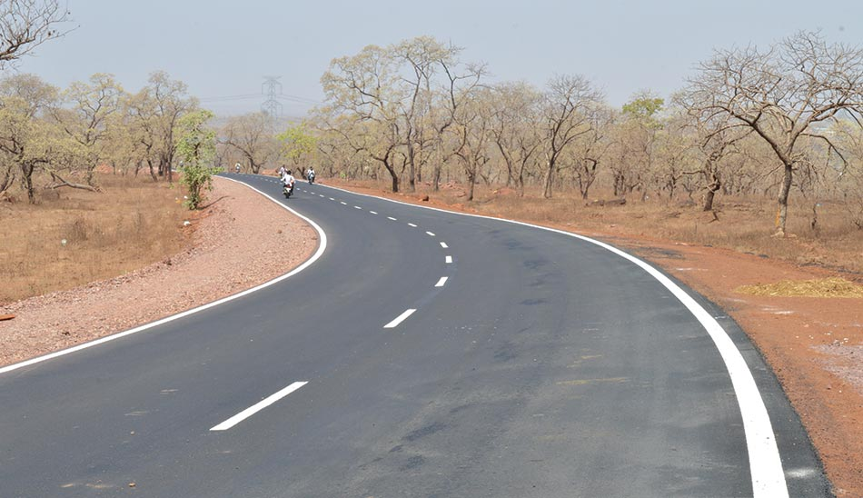
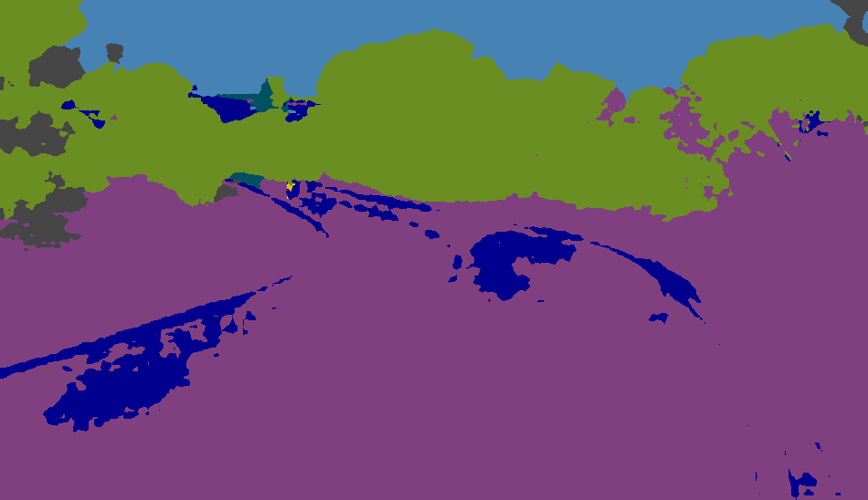
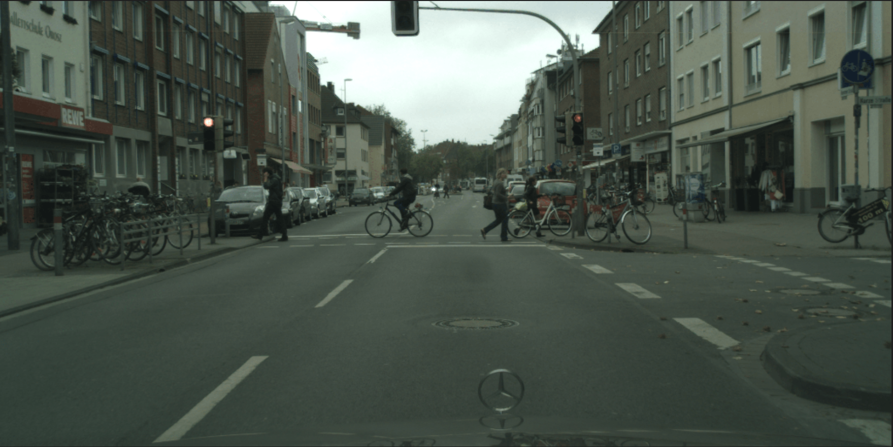
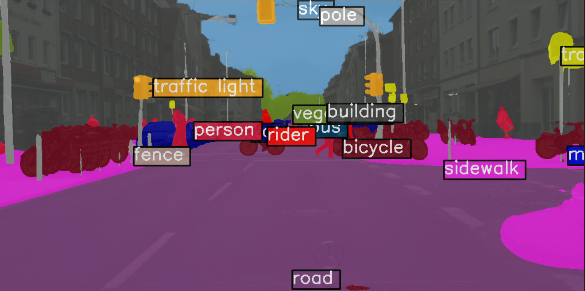
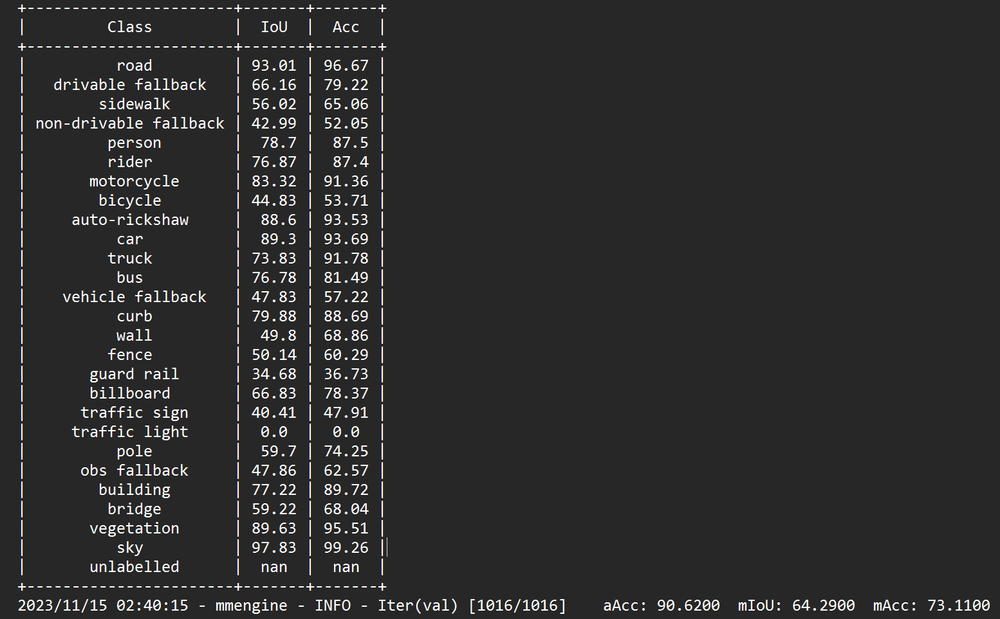

# MMSegmentation Documentation

### What is semantic segmentation?

Semantic segmentation is the task of clustering parts of an image together that belong to the same object class. It is a form of pixel-level prediction because each pixel in an image is classified according to a category. Some example benchmarks for this task are Cityscapes, PASCAL VOC and ADE20K. Models are usually evaluated with the Mean Intersection-Over-Union (Mean IoU) and Pixel Accuracy metrics.

### Aim
Traditional deeplabv3 plus model trained on cityscapes dataset which provides a great MioU of 80 on urban roads fails miserably on rural or low resolution dataset. 
For Example:




This shows that finetuning the previously trained model or base training the model for the custom dataset is extremely important. We do so in this project using MMSegmentation

### What is MMSegmentation?

MMSegmentation is a toolbox that provides a framework for unified implementation and evaluation of semantic segmentation methods, and contains high-quality implementations of popular semantic segmentation methods and datasets.

Link to the entire MMSeg Documentation: [MMSeg](https://github.com/open-mmlab/mmsegmentation/tree/main)

## Installation

### Prerequisites

0. Download and install Miniconda from the official website.
1. Create a conda environment and activate it.
   
```powershell
conda create --name openmmlab python=3.8 -y
conda activate openmmlab
```

2. Install PyTorch following official instructions (Always prefer Pip Method)
   
```powershell
pip3 install torch torchvision torchaudio --index-url https://download.pytorch.org/whl/cu118
```

> [!NOTE]
> Make sure to check that the GPU version of torch is installed.

To determine if your PyTorch installation supports GPU

```python
import torch
print(torch.version.cuda)
```

### Installations

0. Install MMCV using MIM

```powershell
pip install -U openmim
mim install mmengine
mim install "mmcv>=2.0.0"
pip install ftfy (Incase, otherwise requirement already satisfied)
```

1. Git clone MMSegmentation

```powershell
git clone -b main https://github.com/open-mmlab/mmsegmentation.git
cd mmsegmentation
pip install -v -e .
```

### Verify the installation

1. Download config and checkpoint files.

```powershell
mim download mmsegmentation --config pspnet_r50-d8_4xb2-40k_cityscapes-512x1024 --dest .
```

2. Verify the inference demo.

```powershell
python demo/image_demo.py demo/demo.png configs/pspnet/pspnet_r50-d8_4xb2-40k_cityscapes-512x1024.py pspnet_r50-d8_512x1024_40k_cityscapes_20200605_003338-2966598c.pth --device cuda:0 --out-file result.jpg
```

You will see a new image result.jpg on your current folder, where segmentation masks are covered on all objects.

### Inferencing
(Generating seg map based on previously trained models)

```python
from mmseg.apis import MMSegInferencer
# Load models into memory
inferencer = MMSegInferencer(model='deeplabv3plus_r18-d8_4xb2-80k_cityscapes-512x1024')

# images can be a list of image path or np.ndarray
images = ['demo/demo.png']

# Save visualized rendering color maps and predicted results
# out_dir is the directory to save the output results, img_out_dir and pred_out_dir are subdirectories of out_dir
# to save visualized rendering color maps and predicted results
inferencer(images, out_dir='outputs', img_out_dir='vis', pred_out_dir='pred')

# this prints out the list of all the model that MMSeg supports
models = MMSegInferencer.list_models('mmseg')

```

<p align="center"> Demo image </p>


<p align="center"> Inferred image using deeplabv3plus for cityscapes</p>

### Preparing Dataset

Once you untar your data tar file. For instance idd-20k.tar.gz. You will be left with the image folder idd20kII with gtFine and leftImg8bit subfolders. This can now be your data root.

The easiest way to set up MMseg data for training is to divide your data into four folders. You can mkdir the following four directories in your data root.

1. train_img: Folder with all the training images
2. train_label: Folder with all the respective ground images of the training images
3. val_img: Folder with all the validation images
4. val_label: Folder with all the respective ground images of the validation images


> [!IMPORTANT]
> The name of the training image and its respective ground image must have the same filename for both training and
> validation. (The extensions could be different) 
>
> For example:  if the training image is 0000002.jpg, then the respective ground image in the train_label must all be either 0000002.jpg or 0000002.png

I have provided a python script called [split_creator.py](split_creator.py)

The copy_images() function copies all the image from inside the sub-directories to a destination folder and in process all renames the file based on suffix replacer to get consistent filenames for both train_img and train_label folders.

To ensure that the images loaded to the trainer function are random. A split folder with train.txt and val.txt is also created, this is also implemented in the split_creator.py

Make sure that you correctly set the data_root, train_img_dir, train_ann_dir, val_img_dir and val_ann_dir. 

For Example:

```python
# define dataset root and directory for images and annotations
data_root = 'idd20kII'
train_img_dir = 'train_img'
train_ann_dir = 'train_label'
val_img_dir = 'val_img'
val_ann_dir = 'val_label'

```

Define the different classes and the corresponding palette based on the segmentation followed by the ground truth images. 

```python

# define class and palette for better visualization
classes = ('road', 'drivable fallback', 'sidewalk', 'non-drivable fallback', 'person', 'rider', 'motorcycle',
'bicycle', 'auto-rickshaw', 'car', 'truck', 'bus', 'vehicle fallback', 'curb', 'wall', 'fence', 'guard rail',
'billboard', 'traffic sign', 'traffic light', 'pole', 'obs fallback', 'building', 'bridge', 'vegetation', 'sky',
'unlabelled')

palette = [[0], [1], [2], [3], [4], [5], [6], [7], [8], [9], [10], [11], [12], [13], [14], [15], [16], [17],
[18], [19], [20], [21], [22], [23], [24], [25], [255]]

# Note, the classes and palette here is based on the Indian Driving Dataset. In case of ground images
# with RGB channels instead of mono channels, you can define the palette as: 

palette = [[0,0,0], [128, 0, 0], [0, 128, 0], [0, 0, 128], [128, 128, 0], [128,0,128], [0, 128, 128], [128, 128, 128]]
(The palette definition follows BGR format instead of RGB)

```

> [!TIP]
> The major advantage of using MMSegmentation for training purposes is the ease it provides to try out different segmentation models. Just download the required model config file and you are all good to go. 

Config file: A configuration file in MMSegmentation is a text file that contains various settings and parameters to configure the behavior of the segmentation model. These configuration files are typically written in YAML (YAML Ain't Markup Language) format, which is a human-readable data serialization format.

```powershell
# Download config and checkpoint files
!mim download mmsegmentation --config deeplabv3plus_r101-d8_4xb2-80k_cityscapes-512x1024 --dest .
```

This downloads the resnet101 based deeplabv3 model fine tuned for training cityscapes with 80k iterations and having a crop size of 512x1024. You can get a list of the config file on MMSeg using 

```python
from mmseg.apis import MMSegInferencer
models = MMSegInferencer.list_models('mmseg')
```

> [!NOTE]
> The base train MIoU values associated with each of the models are mentioned on the MMSegmentation github. 
> The above command also downloads the checkpoint .pkl file for the required model, which can be directly used in case required to finetune the model, instead of base training it.	

### Training and Validation

The further steps to training is mentioned in the [train_file.py](train_file.py)

We begin with defining the dataset root and directory for images and annotations, along with the classes and the palette in the similar fashion as mentioned above.

```python
from mmseg.registry import DATASETS
from mmseg.datasets import BaseSegDataset
#Now we register this dataset module

@DATASETS.register_module()

class IDD_Data(BaseSegDataset):
  METAINFO = dict(classes = classes, palette = palette)
  def __init__(self, **kwargs):
    super().__init__(img_suffix='.jpg', seg_map_suffix='.png', **kwargs)
```

The name of the dataset module in the above code is IDD_Data and is initialized with classes and palette we defined earlier in the code. Also the img_suffix and seg_map_suffix tells about the file type to be used when training.

```python
# The class Config imported from mmengine is used to easily modify the config according to our requirements.

from mmengine import Config

cfg = Config.fromfile('/content/mmsegmentation/deeplabv3plus_r101-d8_4xb2-80k_cityscapes-512x1024.py')
# This print the config in readable format.
print(f'Config:\n{cfg.pretty_text}')
```

Then we edit the config based on our requirements.

```python
from mmengine.runner import Runner

# The size based on which the image is cropped before loading it into the model.
cfg.crop_size = (512,512)

# Since we use only one GPU, BN is used instead of SyncBN
cfg.norm_cfg = dict(type='BN', requires_grad=True)
cfg.model.data_preprocessor.size = cfg.crop_size
cfg.model.backbone.norm_cfg = cfg.norm_cfg
cfg.model.decode_head.norm_cfg = cfg.norm_cfg
cfg.model.auxiliary_head.norm_cfg = cfg.norm_cfg

# modify num classes of the model in decode/auxiliary head
cfg.model.decode_head.num_classes = 27
cfg.model.auxiliary_head.num_classes = 27

# Modify dataset type as defined in the dataset module and path
cfg.dataset_type = 'IDD_Data' 
cfg.data_root = data_root

# No. of images to be loaded in a single batch 
cfg.train_dataloader.batch_size = 4

# We then change the scale in the train_pipeline and test_pipeline based on the dimension of our image. 

cfg.train_pipeline = [
    dict(type='LoadImageFromFile'),
    dict(type='LoadAnnotations'),
    dict(type='RandomResize', scale=(1080,1920), ratio_range=(0.5, 2.0), keep_ratio=True),
    dict(type='RandomCrop', crop_size=cfg.crop_size, cat_max_ratio=0.75),
    dict(type='RandomFlip', prob=0.5),
    dict(type='PackSegInputs')
]

cfg.test_pipeline = [
    dict(type='LoadImageFromFile'),
    dict(type='Resize', scale=(1080, 1920), keep_ratio=True),
    # add loading annotation after ``Resize`` because ground truth
    # does not need to do resize data transform
    dict(type='LoadAnnotations'),
    dict(type='PackSegInputs')
]

#Note the img_path and seg_map_path for train and val dataloader.

cfg.train_dataloader.dataset.type = cfg.dataset_type
cfg.train_dataloader.dataset.data_root = cfg.data_root
cfg.train_dataloader.dataset.data_prefix = dict(img_path=train_img_dir, seg_map_path=train_ann_dir)
cfg.train_dataloader.dataset.pipeline = cfg.train_pipeline
cfg.train_dataloader.dataset.ann_file = 'splits/train.txt'

cfg.val_dataloader.dataset.type = cfg.dataset_type
cfg.val_dataloader.dataset.data_root = cfg.data_root
cfg.val_dataloader.dataset.data_prefix = dict(img_path=val_img_dir, seg_map_path=val_ann_dir)
cfg.val_dataloader.dataset.pipeline = cfg.test_pipeline
cfg.val_dataloader.dataset.ann_file = 'splits/val.txt'

cfg.test_dataloader = cfg.val_dataloader


# Load the pretrained weights that got downloaded with the config file
cfg.load_from = 'deeplabv3plus_r101-d8_512x1024_80k_cityscapes_20200606_114143-068fcfe9.pth'

# Set up a working dir to save files and logs.
cfg.work_dir = './work_dirs/tutorial'

# This edits the maximum number of iterations
cfg.train_cfg.max_iters = 80000

# The iteration interval after which the trained model is evaluated on the val set.
cfg.train_cfg.val_interval = 10000

# The logger interval for iterations
cfg.default_hooks.logger.interval = 1000

# The interval to save the checkpoint in the working directory as .pkl.
cfg.default_hooks.checkpoint.interval = 10000

# Set seed to facilitate reproducing the result
cfg['randomness'] = dict(seed=0)

# The final config used for training
print(f'Config:\n{cfg.pretty_text}')

#Now running epochs on the model based on the final config

runner = Runner.from_cfg(cfg)
runner.train()

```

>[!IMPORTANT]
> The above config file finetunes the model after continuing from the saved checkpoint of deeplabv3plus - cityscapes .pkl file
> Incase you want to base train your model, just comment the cfg.load_from line.

### Plotting Result SegMaps

```python
from mmseg.apis import init_model, inference_model, show_result_pyplot

# Init the model from the config and the checkpoint
checkpoint_path = './work_dirs/tutorial/iter_200.pth'
model = init_model(cfg, checkpoint_path, 'cuda:0')

img = mmcv.imread('/content/38719-Rural-Roads.jpg')
result = inference_model(model, img)

plt.figure(figsize=(8, 6))
vis_result = show_result_pyplot(model, img, result, withLabels=False)
plt.imshow(mmcv.bgr2rgb(vis_result))

# The inference_model returns a SegDataSample, to get the segmented image array you can use

seg_arr = result._pred_sem_seg

```

### Results

We saved the checkpoints in work_dirs/tutorial. So from there we get the generated [log](generated_log.log) 
The log clearly shows the number of iterations done based on the hooker iterval and the MIoU result on the validation set. 

Here I have attached the MIoU values on Indian Driving Dataset base trained on DeepLabV3+ for 80000 epochs.


